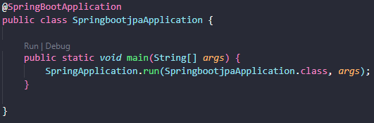

# Menu de Pizzaria

## Descrição Geral

Projeto adaptado com o uso do framework [Spring Boot](https://code.visualstudio.com/docs/java/java-spring-boot) e [MongoDB Atlas](https://www.mongodb.com/atlas/database).

### Descrição do projeto:

Api para um sistema de delivery de pizza, trazendo relações entre usuários, produtos, pedidos e pagamentos.

O projeto consiste em fazer uma api utilizando o [Spring Boot](https://code.visualstudio.com/docs/java/java-spring-boot) com todas as relações **CRUD**.

### EndPoints do projeto:

#### Para Usuário:
- Cadastro: /user/register [Post] Abaixo segue request:
``` Json Body
{
    "name": "string",
    "email": "string",
    "phone": "string",
    "password": "string",
}
```
- Listar: /user [Get]
- Listar pelo Id: /user/{userId} [Get]
- Atualizar: /user/update/{userId} [Put] Abaixo segue request:
``` Json Body
{
    "name": "string",
    "email": "string",
    "phone": "string",
    "password": "string",
}
```
- Remover: /user/delete/{userId} [Delete]

#### Pedidos:
- Cadastro: /order/register/{clientId} [Post] Abaixo segue request:
``` Json Body
{
    // OrderStatus enum type
    "orderStatus": "string",
    // Model Product
    "products": "Product"[]
}
```
- Listar: /order [Get]
- Listar por Id: /order/{orderId} [GET]
- Atualizar: /order/update/{orderId} [PUT] Abaixo segue request:
``` Json Body
{
    // OrderStatus enum type
    "orderStatus": "string"
}
```
- Remover: /order/delete/{id} [Delete]

#### Pagamento:
- Cadastro: /payment/register/{orderId} [Post]

- listar: /payment [Get]

### Descrição - Executar Api Remotamente:
- Link deploy: https://api-menupizzaria.herokuapp.com

### Descrição - Executar Api localmente:
- Para clonar o projeto: git clone https://github.com/TaylanTorres09/DeliverySystem.git
- Para Executar o projeto precisasse:
    - Java [JDK](https://www.oracle.com/java/technologies/downloads/#java17). Este projeto está usando a versão 17.
    - Banco [H2](https://www.h2database.com/html/main.html) para testes utilizado em memória.
    - Banco [MongoDB Atlas](https://www.mongodb.com/atlas/database) para produção.

- Extensões do vscode utilizadas:
    - [Debugger for Java](https://marketplace.visualstudio.com/items?itemName=redhat.java)
    - [Spring Boot Extension Pack](https://marketplace.visualstudio.com/items?itemName=Pivotal.vscode-boot-dev-pack)
    - [Lombok Annotations Support for VS Code](https://marketplace.visualstudio.com/items?itemName=vscjava.vscode-lombok)

- Na pasta src/main, execute o arquivo SpringbootjpaApplication.java



- Para testar a api você pode utilizar ferramentas de client como:
    - [Postman](https://www.postman.com/)
    - [Insomnia](https://insomnia.rest/download)
    - Extensão do VsCode [Thunder Client](https://marketplace.visualstudio.com/items?itemName=rangav.vscode-thunder-client)
    - Ou outra de sua preferência.

### Próximos Passos
- Criar sessão por usuário.

## Autor
<div align="left">
<h3>Taylan Torres</h3>
    
</div>
<div align="left" style="position:absolute; margin-top:195px;">
    <a href="https://www.linkedin.com/in/taylan-torres" target="_blank"></a>
</div>
